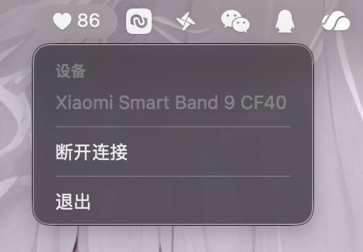

<div align="center">
   
   <h1 style="text-align: center">BLE Heart</h1>
   <p style="text-align: center">macOS菜单栏心率显示</p>
   
</div>


### 如何安装

前往 [Release](https://github.com/hestudio-community/ble-heart/releases/latest) 下载最新版本。

### macOS 安装可能遇到的问题

你在 macOS 上安装的时候可能会遇到 `“BLE Heart.app”已损坏，无法打开。 你应该将它移到废纸篓。` 的问题，一般情况下这并非文件损坏。事实上，如果要完全避免这个问题，我们需要每年向苹果支付 99 美元以生成可信任的证书。我们并没有能力支付这些金额。如果你要使用此软件，可能需要一些额外的操作去完成这件事情。

1. 下载并拖动到 Application 目录。
2. 打开你的终端，然后运行。
   ```shell
   xattr -d com.apple.quarantine '/Applications/BLE Heart.app'
   ```
3. 打开应用程序并开始使用。

